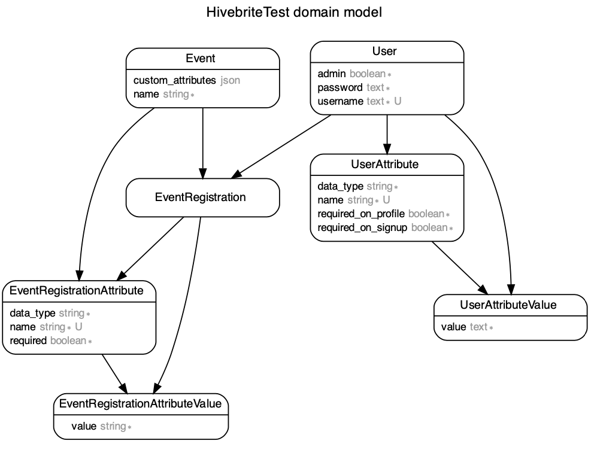

# Hivebrite backend test

## Instructions

The instructions can be found [here](./Instructions.md).

## Getting started

### Ruby version

2.7.1

### System dependencies

- docker
- (optional) dip.yml

### First step

Run the following command to setup the docker container, and setup rails.

```bash
dip provision
```

### Deployment instructions

```bash
dip up rails
```

### How to run the test suite

```bash
dip rspec
```

### Opening the Bash shell in the container

```bash
dip bash
```

## Design

### Entity Relationship Diagram


_made with the `rails-erd` gem_

### Gems

- rspec & shoulda-matchers for testing
- pundit for authorization
- pundit-matchers for testing authorization
- brakeman to run security audits
- database_consistency (self-explainatory)
- rubocop for styling

### Design choice

- Project created without most of the built-in Rails options: `rails new hivebrite-backend-test --skip...`

- I used the [Ruby on Whales](https://evilmartians.com/chronicles/ruby-on-whales-docker-for-ruby-rails-development) guide by [Evil Martians](https://evilmartians.com/) to dockerize my app. I also used the [dip.yml](https://github.com/evilmartians/terraforming-rails/blob/master/examples/dockerdev/dip.yml) tool that they recommend.

- I opted for the ruby-alpine image to limit the size, and opted for SQLite as a database as it simplifies the deployment.

- I tested the associations, validations, and authorization using RSpec. Using the `database-consistency` gem, I also tried to ensure that the requirements set on the database and the Rails app almost identical. I had some issues with index names, and testing validations to ensure that models had the required custom attributes on `:create` or `:update`.
